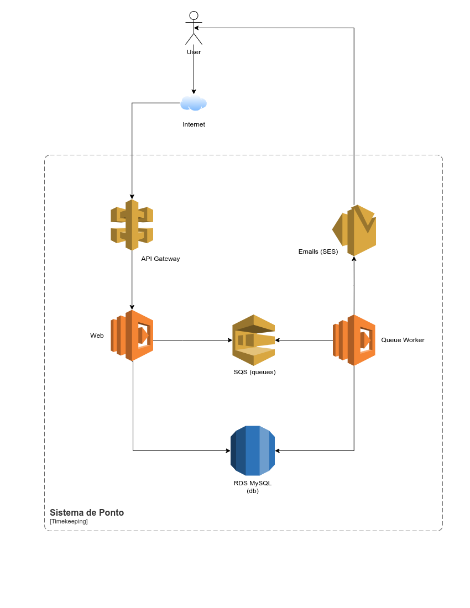
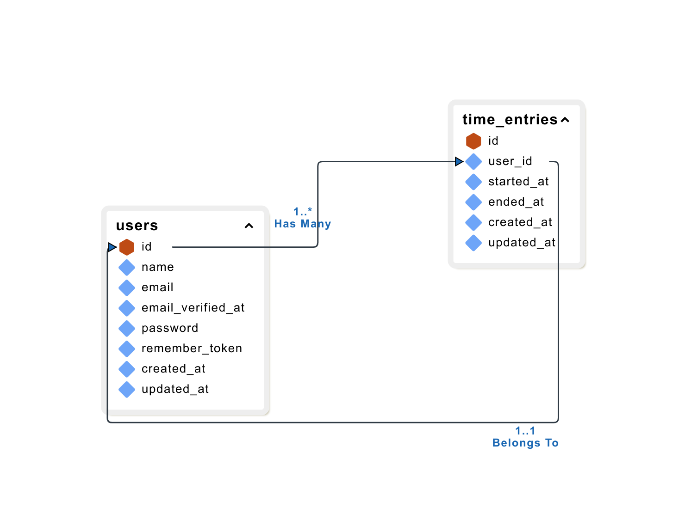
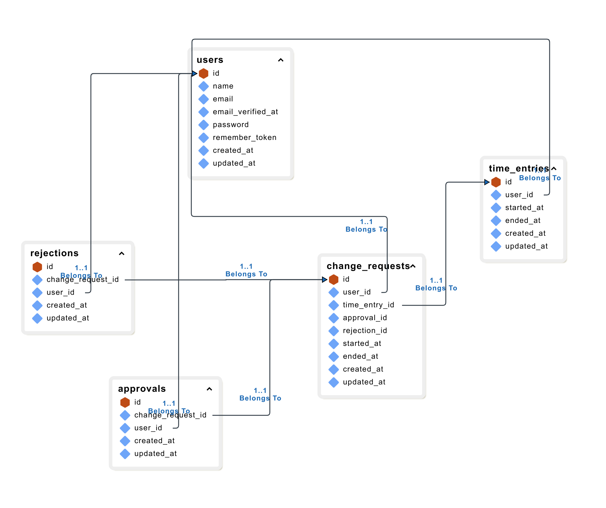

# Descrição

Serviço para contabilização de ponto (horas trabalhadas) do Hackathon do FIAP.

### Como Rodar a Aplicação Localmente

Estamos usando Docker e Docker Compose para rodar a aplicação localmente. Dispomos de um [Dockerfile](./Dockerfile) com a instruções de instalação das dependencias necessárias e também de executação da mesma.

Para rodar a aplicação, siga os passos abaixos:

1. Crie o arquivo `.env`, instale as dependencias via Composer, e gere a `APP_KEY`:

```bash
cp .env.example .env
docker compose run --rm app composer install
docker compose run --rm app php artisan key:generate
```

2. Suba os serviços (Web, Database/MySQL, SMTP/Mailpit):

```bash
docker compose up -d
```

3. Execute as migrations e seeder para criar o usuário teste:

```bash
docker compose exec app php artisan migrate --seed
```

Talvez você tenha que esperar alguns segundos para o container do MySQL subir e ficar disponível.

Isso é tudo.

### Justificativa da Arquitetura Escolhida

Optamos por usar um framework monolitíco, apenas aplicando uma leve modularização em cima da estrutura padrão mesmo. O Laravel, o framework escolhido, permite esse tipo de customização.

Embora o Laravel seja um Framework monolítico, através do Laravel Vapor, ele consegue quebrar os entrypoints da aplicação em lambdas diferentes de forma automática. Então, em produção, teremos 3 lambdas:

- Web: encarregada de responder a todas as requisições web
- Queue: engarregada de executar todos os Background Jobs que serão enviados pro SQS (de forma automática via triggers)
- CLI: para executar o scheduler do Laravel ou comands one-off

Dessa forma, teremos um ambiente altamente escalável e distribuído, mas mantendo a facilidade e praticidade de um framework monolítico.

A nível de organização e modularização, temos dois módulos: `User` e `Timekeeping`.

#### Módulo `User`

Esse módulo deve englobar tudo relacionado a usuários e autenticação. A entidade _aggregate_ aqui é o model `User`. Podemos encontrar também os arquivos de migrações (para alterações automatizadas da entrutura do banco de dados), e as fábricas de modelos (para facilitar a fabricação de modelos nos testes). Os casos de uso (serviços) podem ser encontrados aqui também.

#### Módulo `Timekeeping`

Esse módulo deve englobar tudo relacionado ao domínio de pontos (horas trabalhadas). A entidade _aggregate_ aqui é o model `TimeEntry`. Podemos encontrar também os arquivos de migrações (para alterações automatizadas da entrutura do banco de dados), e as fábricas de modelos (para facilitar a fabricação de modelos nos testes). Os casos de uso (serviços) podem ser encontrados aqui também.

#### Relatórios OWASP ZAP

Ao executar o ZAP em alguns endpoints (registrar ponto e atualizar ponto), não identificamos nenhuma vulnerabilidade alta, dessa forma foi não necessário gerar um relatório do antes e um do depois.

Link para o relatório: [2024-03-24-ZAP-Report.pdf](./resources//docs/2024-03-24-ZAP-Report.pdf)

#### Desenho da Arquitetura

Arquitetura da aplicação:



Diagram ER da Fase 1:



### Justificativa Fase 2

Para a fase 2, a arquitetura seria a mesma. Apenas adicionariamos alguns modelos a mais, como por exemplo um `ChangeRequest` e um `Approval` ou `Rejection`.

O dashboard seria adicionado usando ou [Filament](https://filamentphp.com/) ou um [Laravel Nova](https://nova.laravel.com/) da mesmo. O "grant" de "admin" seria dado por ambiente via configuração (setar os IDs dos usuários com acesso ao dashboard de admin via configuração de ambiente).

Diagrama ER _sugerido_ da mudança para fase 2:



#### Video de Apresentação

Vídeo no YouTube: [https://youtu.be/CqatXNXSFx0](https://youtu.be/CqatXNXSFx0)
